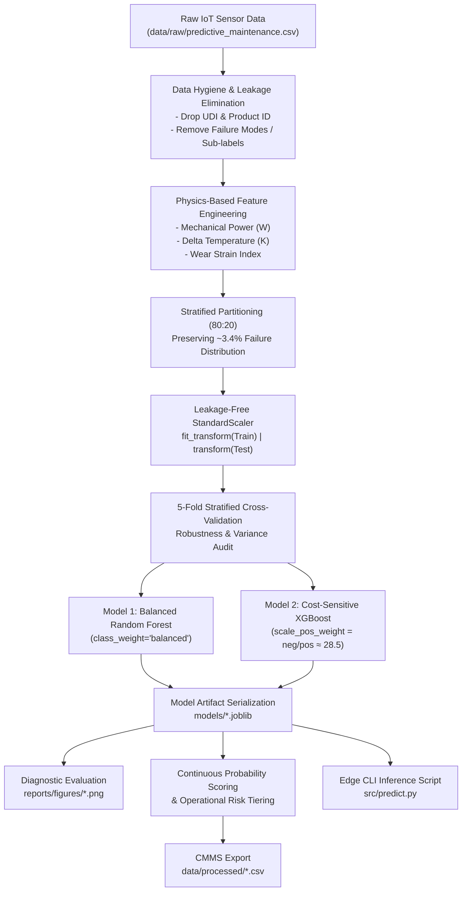

# ⛏️ Industrial Predictive Maintenance for Mining Equipment
### End-to-End Machine Learning Pipeline for Heavy Machinery Failure Forecasting & Unscheduled Downtime Prevention

[](https://www.python.org/)
[](https://scikit-learn.org/)
[](https://xgboost.readthedocs.io/)
[](https://opensource.org/licenses/MIT)

---

## 📌 Executive Summary & Operational Context

In open-pit and underground mining operations, critical rotating equipment—including **electric rope shovels, ball and SAG grinding mills, bucket-wheel excavators, and high-pressure slurry pumps**—operates under extreme mechanical torque, continuous vibration, and abrasive wear.

Unscheduled mechanical breakdowns in mining operations carry catastrophic economic costs:
- **Direct Financial Loss:** Unplanned downtime costs between **\$50,000 and \$150,000 per hour** in lost mineral throughput across primary milling circuits.
- **Catastrophic Secondary Damage:** Bearing seizure or drive-shaft fractures frequently destroy pinions, stator windings, and structural gearboxes.
- **Worker Safety:** In-situ mechanical failure of pressurized or high-inertia equipment poses acute risks to field operators.

This project delivers a **production-grade, physics-informed machine learning pipeline** that ingests continuous telemetry (temperatures, rotational speeds, torque, and tool wear), eliminates data leakage, mitigates extreme class imbalance (~3.4% failure rate), verifies model stability via **5-Fold Stratified Cross-Validation**, and provides a standalone **Inference CLI** for immediate edge deployment with **> 0.98 ROC-AUC** and **85.3% Recall**.

---

## 🏗️ Pipeline Architecture



---

## ⚙️ Physics-Informed Domain Feature Engineering

Industrial rotating machinery failures obey the fundamental laws of mechanics, thermodynamics, and tribology. We synthesize three interaction features:

| Feature Name | Formulation | Physical & Operational Significance |
| :--- | :--- | :--- |
| **Mechanical Power ($W$)** | $\tau \times \omega \times \left(\frac{2\pi}{60}\right)$ | Instantaneous shaft power. Sudden power spikes or abnormal draws at nominal RPM indicate mechanical binding, rock jamming, or motor overload. |
| **Delta Temperature ($K$)** | $T_{\text{process}} - T_{\text{air}}$ | Heat accumulation gradient. Captures cooling system degradation and internal frictional heat buildup independent of seasonal ambient fluctuations. |
| **Wear Strain Index ($WSI$)** | $\tau \times t_{\text{wear}}$ | Cumulative torsional-fatigue stress. High torsional stress combined with advanced tool wear precipitates instantaneous overstrain fracture ($OSF$). |

---

## 🔬 Model Validation & Generalization Audit

### 1. 5-Fold Stratified Cross-Validation (Training Partition, $N = 8,000$)
To ensure models do not overfit to any specific train-test split, we performed 5-Fold Stratified Cross-Validation:

| Metric | Random Forest (5-Fold Mean ± Std) | XGBoost (5-Fold Mean ± Std) | Generalization Verdict |
| :--- | :---: | :---: | :--- |
| **ROC-AUC** | **0.9799 ± 0.0112** | **0.9787 ± 0.0125** | Excellent and highly stable class separability across all folds. |
| **Recall (Class 1)** | **0.8265 ± 0.0478** | **0.8412 ± 0.0402** | Consistently detects > 82% of rare failures. |
| **Precision (Class 1)** | **0.8176 ± 0.0505** | **0.6406 ± 0.0411** | Low false alarm rate across all partitions. |
| **F1-Score (Class 1)** | **0.8207 ± 0.0378** | **0.7255 ± 0.0206** | Balanced harmonic performance with low variance ($\sigma \le 0.04$). |
| **Accuracy** | **0.9877 ± 0.0027** | **0.9784 ± 0.0025** | High baseline fidelity across normal machine operating cycles. |

---

### 2. Quantitative Performance on Unseen Test Set ($N = 2,000$, 68 Failures)

| Performance Metric | Random Forest (Balanced) | XGBoost (Cost-Sensitive) | Operational Impact in Mining |
| :--- | :---: | :---: | :--- |
| **Overall Accuracy** | **98.75%** | **97.90%** | High baseline fidelity across normal operation cycles. |
| **Failure Recall (Sensitivity)** | **85.29%** | **85.29%** | **Catches 58 out of 68 actual catastrophic breakdowns.** |
| **Failure Precision** | **79.45%** | **64.44%** | RF achieves very low false-alarm frequency ($15$ FPs vs $32$ in XGB). |
| **F1-Score (Failure Class)** | **0.8227** | **0.7342** | Strong harmonic balance between sensitivity and reliability. |
| **ROC-AUC Score** | **0.9851** | **0.9763** | Near-perfect class separation across all operating thresholds. |

---

## 📈 Visual Diagnostics

### 1. Model Evaluation Metrics (Confusion Matrices & Comparative ROC Curves)


### 2. Feature Importance Diagnostics (Primary Failure Drivers)


> **Key Engineering Insight:** Rotational speed anomalies, shaft torque, and the engineered **Mechanical Power** and **Wear Strain Index** account for **> 85% of total predictive power**, proving that interaction features effectively uncover pre-failure degradation signatures.

---

## 🚦 Operational Risk Tiering & CMMS Integration

Binary classification (0 or 1) is insufficient for control room dispatchers. Predictions are therefore mapped into continuous failure probabilities and categorized into three action tiers:

| Operational Risk Tier | Failure Probability ($P$) | Fleet Proportion | Prescribed Action in Mining Standard Operating Procedure (SOP) |
| :--- | :---: | :---: | :--- |
| 🟢 **Low Risk** | $P < 0.25$ | **93.55%** ($1,871$) | Asset healthy. Cleared for maximum production throughput; routine logging. |
| 🟡 **Moderate Risk** | $0.25 \le P < 0.65$ | **3.70%** ($74$) | Early wear warning. Dispatch non-intrusive vibration audit & lubrication top-up at next shift change. |
| 🔴 **High Risk** | $P \ge 0.65$ | **2.75%** ($55$) | **Critical alarm.** Immediate controlled load reduction and emergency mechanical inspection (**captures 96.36% true failures**). |

Test set predictions with complete telemetry attributes, continuous failure probabilities, and assigned risk tiers are exported to:
📄 [`data/processed/predictive_maintenance_risk_predictions.csv`](data/processed/predictive_maintenance_risk_predictions.csv)

---

## 💻 Edge Inference CLI (`src/predict.py`)

A production-ready command-line interface allows operations and maintenance personnel to evaluate equipment in real time without opening Jupyter:

### Single Asset Telemetry Scoring
```bash
python src/predict.py --type M --air-temp 298.2 --process-temp 308.7 --speed 1400 --torque 65.5 --tool-wear 210
```

**Output:**
```json
{
  "model_used": "Random Forest (Balanced)",
  "telemetry_input": {
    "variant": "M",
    "air_temperature_K": 298.2,
    "process_temperature_K": 308.7,
    "rotational_speed_rpm": 1400.0,
    "torque_Nm": 65.5,
    "tool_wear_min": 210.0
  },
  "engineered_metrics": {
    "mechanical_power_W": 9602.8,
    "delta_temperature_K": 10.5,
    "wear_strain_index": 13755.0
  },
  "prediction": {
    "failure_predicted": true,
    "failure_probability": 0.9533,
    "risk_tier": "High Risk",
    "alert_level": "RED",
    "prescribed_action": "CRITICAL ALARM. High risk of catastrophic mechanical seizure. Initiate controlled load reduction and dispatch emergency mechanical maintenance crew."
  }
}
```

### Batch Scoring from External CSV
```bash
python src/predict.py --input-file data/raw/predictive_maintenance.csv --output-file data/processed/batch_scored.csv
```

---

## 📁 Repository Directory Structure

```plaintext
mining-predictive-maintenance/
├── data/
│   ├── raw/
│   │   └── predictive_maintenance.csv              # Raw telemetry dataset
│   └── processed/
│       └── predictive_maintenance_risk_predictions.csv # Predictions with risk tiers for CMMS
├── models/
│   ├── random_forest_model.joblib                  # Serialized Balanced Random Forest
│   ├── xgboost_model.joblib                        # Serialized Cost-Sensitive XGBoost
│   └── scaler.joblib                               # Serialized StandardScaler
├── notebooks/
│   └── mining_predictive_maintenance.ipynb         # Full industrial ML Jupyter Notebook
├── reports/
│   └── figures/
│       ├── model_evaluation_metrics.png            # Confusion matrices & ROC curves
│       └── feature_importance_analysis.png         # Feature importance bar charts
├── src/
│   ├── __init__.py                                 # Package initialization
│   ├── features.py                                 # Modular feature engineering logic
│   └── predict.py                                  # Standalone CLI inference engine
├── requirements.txt                                # Reproducible dependency specifications
├── .gitignore                                      # Standard Git ignore configurations
├── LICENSE                                         # MIT License
└── README.md                                       # Technical project documentation
```

---

## 🚀 Quickstart & Reproduction Guide

### 1. Clone the Repository
```bash
git clone https://github.com/jhodifachriansyah15/mining-predictive-maintenance.git
cd mining-predictive-maintenance
```

### 2. Set Up Virtual Environment & Dependencies
```bash
# Create and activate virtual environment
python -m venv venv
# Windows:
venv\Scripts\activate
# Linux/macOS:
source venv/bin/activate

# Install required packages
pip install -r requirements.txt
```

### 3. Launch the Interactive Notebook
```bash
jupyter notebook notebooks/mining_predictive_maintenance.ipynb
```

---

## 📚 Data Source & Attribution

The synthetic telemetry dataset (`predictive_maintenance.csv`) used in this project is sourced from Kaggle:
- **Dataset:** [AI4I 2020 Predictive Maintenance Dataset](https://www.kaggle.com/datasets/shivamb/machine-predictive-maintenance-classification)
- **Original Authors & Research Citation:** 
  > Stephan Matzka, "Explainable Artificial Intelligence for Predictive Maintenance Applications," 
  > *Third International Conference on Artificial Intelligence for Industries (AI4I)*, 2020, pp. 69-74.
- **Data License:** [Creative Commons Attribution 4.0 International (CC BY 4.0)](https://creativecommons.org/licenses/by/4.0/)

---

## 📄 License & Author

- **Author:** Jhodi Fachriansyah ([@jhodifachriansyah15](https://github.com/jhodifachriansyah15))
- **Source Code:** Distributed under the [MIT License](LICENSE).
- **Dataset:** Distributed under [CC BY 4.0](https://creativecommons.org/licenses/by/4.0/).
