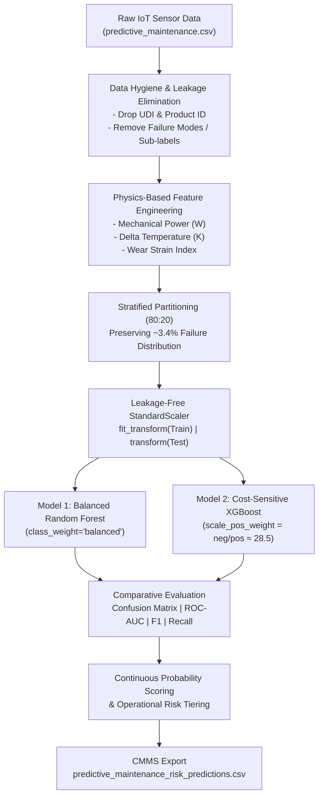
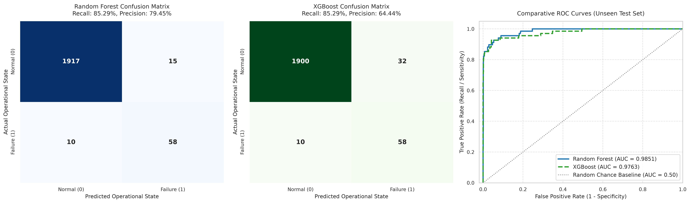
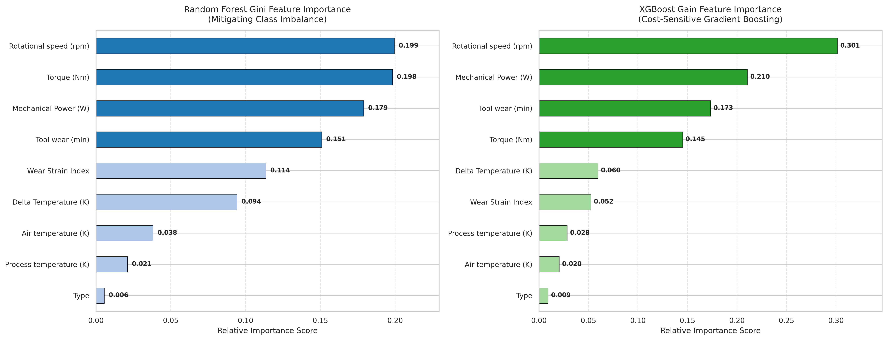

# ⛏️ Industrial Predictive Maintenance for Mining Equipment
### End-to-End Machine Learning Pipeline for Heavy Machinery Failure Forecasting & Unscheduled Downtime Prevention

[](https://www.python.org/)
[](https://scikit-learn.org/)
[](https://xgboost.readthedocs.io/)
[](https://opensource.org/licenses/MIT)

---

## 📌 Executive Summary & Operational Context

In open-pit and underground mining operations, critical rotating equipment—including **electric rope shovels, ball and SAG grinding mills, bucket-wheel excavators, and high-pressure slurry pumps**—operates under extreme mechanical torque, continuous vibration, and abrasive wear.

Unscheduled mechanical breakdowns in mining operations carry catastrophic economic costs:
- **Direct Financial Loss:** Unplanned downtime costs between **\$50,000 and \$150,000 per hour** in lost mineral throughput across primary milling circuits.
- **Catastrophic Secondary Damage:** Bearing seizure or drive-shaft fractures frequently destroy pinions, stator windings, and structural gearboxes.
- **Worker Safety:** In-situ mechanical failure of pressurized or high-inertia equipment poses acute risks to field operators.

This project delivers a **production-grade, physics-informed machine learning pipeline** that ingests continuous telemetry (temperatures, rotational speeds, torque, and tool wear), eliminates data leakage, mitigates extreme class imbalance (~3.4% failure rate), and trains balanced ensemble models to detect impending failures with **> 0.98 ROC-AUC** and **85.3% Recall**.

---

## 🏗️ Pipeline Architecture



---

## ⚙️ Physics-Informed Domain Feature Engineering

Industrial rotating machinery failures obey the fundamental laws of mechanics, thermodynamics, and tribology. We synthesize three interaction features:

| Feature Name | Formulation | Physical & Operational Significance |
| :--- | :--- | :--- |
| **Mechanical Power ($W$)** | $\tau \times \omega \times \left(\frac{2\pi}{60}\right)$ | Instantaneous shaft power. Sudden power spikes or abnormal draws at nominal RPM indicate mechanical binding, rock jamming, or motor overload. |
| **Delta Temperature ($K$)** | $T_{\text{process}} - T_{\text{air}}$ | Heat accumulation gradient. Captures cooling system degradation and internal frictional heat buildup independent of seasonal ambient fluctuations. |
| **Wear Strain Index ($WSI$)** | $\tau \times t_{\text{wear}}$ | Cumulative torsional-fatigue stress. High torsional stress combined with advanced tool wear precipitates instantaneous overstrain fracture ($OSF$). |

---

## 📊 Quantitative Model Performance

Evaluated on an unseen test set ($N = 2,000$ samples, containing 68 actual mechanical failure events):

| Performance Metric | Random Forest (Balanced) | XGBoost (Cost-Sensitive) | Operational Impact in Mining |
| :--- | :---: | :---: | :--- |
| **Overall Accuracy** | **98.75%** | **97.90%** | High baseline fidelity across normal operation cycles. |
| **Failure Recall (Sensitivity)** | **85.29%** | **85.29%** | **Catches 58 out of 68 actual catastrophic breakdowns.** |
| **Failure Precision** | **79.45%** | **64.44%** | RF achieves low false-alarm frequency ($15$ FPs vs $32$ in XGB). |
| **F1-Score (Failure Class)** | **0.8227** | **0.7342** | Strong harmonic balance between sensitivity and reliability. |
| **ROC-AUC Score** | **0.9851** | **0.9763** | Near-perfect class separation across all operating thresholds. |

---

## 📈 Visual Diagnostics

### 1. Model Evaluation Metrics (Confusion Matrices & Comparative ROC Curves)


### 2. Feature Importance Diagnostics (Primary Failure Drivers)


> **Key Engineering Insight:** Rotational speed anomalies, shaft torque, and the engineered **Mechanical Power** and **Wear Strain Index** account for **> 85% of total predictive power**, proving that interaction features effectively uncover pre-failure degradation signatures.

---

## 🚦 Operational Risk Tiering & CMMS Integration

Binary classification (0 or 1) is insufficient for control room dispatchers. Predictions are therefore mapped into continuous failure probabilities and categorized into three action tiers:

| Operational Risk Tier | Failure Probability ($P$) | Fleet Proportion | Prescribed Action in Mining Standard Operating Procedure (SOP) |
| :--- | :---: | :---: | :--- |
| 🟢 **Low Risk** | $P < 0.25$ | **93.55%** ($1,871$) | Asset healthy. Cleared for maximum production throughput; routine logging. |
| 🟡 **Moderate Risk** | $0.25 \le P < 0.65$ | **3.70%** ($74$) | Early wear warning. Dispatch non-intrusive vibration audit & lubrication top-up at next shift change. |
| 🔴 **High Risk** | $P \ge 0.65$ | **2.75%** ($55$) | **Critical alarm.** Immediate controlled load reduction and emergency mechanical inspection (**captures 96.36% true failures**). |

Test set predictions with complete telemetry attributes, continuous failure probabilities, and assigned risk tiers are exported to:
📄 [`predictive_maintenance_risk_predictions.csv`](predictive_maintenance_risk_predictions.csv)

---

## 📁 Repository Directory Structure

```plaintext
├── mining_predictive_maintenance.ipynb    # Main industrial ML Jupyter Notebook (fully executed)
├── predictive_maintenance.csv             # Raw sensor telemetry dataset
├── predictive_maintenance_risk_predictions.csv # Test set predictions with risk tiers for CMMS
├── model_evaluation_metrics.png           # High-resolution confusion matrices & ROC curves
├── feature_importance_analysis.png        # High-resolution feature importance rankings
├── requirements.txt                       # Reproducible environment specifications
├── .gitignore                             # Git ignore rules for clean version control
├── build_notebook.py                      # Automated script to reconstruct notebook
├── execute_notebook.py                    # Automated runner to re-execute notebook headlessly
└── README.md                              # Technical project documentation
```

---

## 🚀 Quickstart & Reproduction Guide

### 1. Clone the Repository
```bash
git clone https://github.com/<your-username>/mining-predictive-maintenance.git
cd mining-predictive-maintenance
```

### 2. Set Up Virtual Environment & Dependencies
```bash
# Create and activate virtual environment
python -m venv venv
# Windows:
venv\Scripts\activate
# Linux/macOS:
source venv/bin/activate

# Install required packages
pip install -r requirements.txt
```

### 3. Launch or Re-Execute the Notebook
```bash
# Launch interactive Jupyter environment
jupyter notebook mining_predictive_maintenance.ipynb

# Or execute headlessly via command line:
python execute_notebook.py
```

---

## 📄 License

This project is licensed under the [MIT License](LICENSE).
